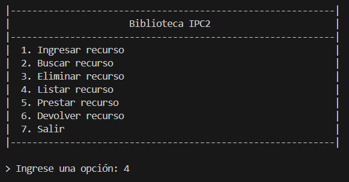
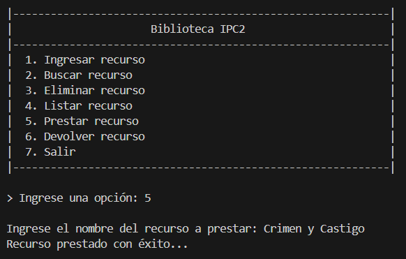

# IPC2_Tarea1VD_202300694

|                 Nombre             |   Carnet  |
| ---------------------------------- | --------- |
| Eduardo Sebastian Gutierrez Felipe | 202300694 |

## Uso de POO

### Clase Principal:

```python
from .Recurso import Recurso
from .Libro import Libro
from .Revista import Revista
from .Video import Video

class Biblioteca:

    __recursos = []

    def agregarRecurso(self, recurso):
        self.__recursos.append(recurso)

    def mostrarRecursosDisponibles(self):
        for recurso in self.__recursos: 
            if recurso.getDisponibilidad() == True:
                recurso.informacionDetallada()

    def buscarPorAutor(self, autor):
        for recurso in self.__recursos:
            if recurso.getAutor() == autor:
                recurso.informacionDetallada()

    def buscarPorTipo(self, tipo):
        for recurso in self.__recursos:
            if tipo == "Libro" or tipo == "libro":
                if isinstance(recurso, Libro):
                    recurso.informacionDetallada()
            elif tipo == "Revista" or tipo == "revista":
                if isinstance(recurso, Revista):
                    recurso.informacionDetallada()
            elif tipo == "Video" or tipo == "video":
                if isinstance(recurso, Video):
                    recurso.informacionDetallada()


    def eliminarRecurso(self, Recurso):
        for recurso in self.__recursos:
            if recurso.getTitulo() == Recurso:
                self.__recursos.remove(recurso)

    def prestarRecurso(self, Recurso):
        for recurso in self.__recursos:
            if recurso.getTitulo() == Recurso:
                recurso.prestar()

    def devolverRecurso(self, Recurso):
        for recurso in self.__recursos:
            if recurso.getTitulo() == Recurso:
                recurso.devolver()

    def getRecursos(self):
        return self.__recursos
```

### Clase Padre:

```python
class Recurso:
    def __init__(self, titulo, autor, anioPublicacion):
        self.__titulo = titulo
        self.__autor = autor
        self.__anioPublicacion = anioPublicacion
        self.__disponibilidad = True

    def informacionDetallada(self, tipo):
        print("")
        print("|" + "-"*61 + "|")
        print(f"|{"Recurso":^61}|")
        print(f"|{"Recurso":<30}|{tipo:<30}|")
        print(f"|{"Título":<30}|{self.__titulo:<30}|")
        print(f"|{"Autor":<30}|{self.__autor:<30}|")
        print(f"|{"Año de publicación":<30}|{self.__anioPublicacion:<30}|")
        print(f"|{"Disponibilidad":<30}|{str(self.__disponibilidad):<30}|")


    def prestar(self):
        self.__disponibilidad = False
    
    def devolver(self):
        self.__disponibilidad = True

    #SETTERS
    def setTitulo(self, titulo):
        self.__titulo = titulo
    
    def setAutor(self, autor): 
        self.__autor = autor

    def setAnioPublicacion(self, anio):
        self.__anioPublicacion = anio

    #GETTERS
    def getTitulo(self):
        return self.__titulo
    
    def getAutor(self):
        return self.__autor
    
    def getAnioPublicacion(self):
        return self.__anioPublicacion
    
    def getDisponibilidad(self):
        return self.__disponibilidad
```

### Clase Hijo 1: Libro

```python
from .Recurso import Recurso

class Libro(Recurso):
    def __init__(self, titulo, autor, anioPublicacion, genero, numeroPaginas):
        super().__init__(titulo, autor, anioPublicacion)
        self.__genero = genero
        self.__numeroPaginas = numeroPaginas

    def informacionDetallada(self):
        super().informacionDetallada("Libro")
        print(f"|{"Genero":<30}|{self.__genero:<30}|")
        print(f"|{"Número de páginas":<30}|{self.__numeroPaginas:<30}|")
        print("|" + "-"*61 + "|")
        print("")

    #SETTERS
    def setGenero(self, genero):
        self.__genero = genero

    def setNumeroPaginas(self, numero):
        self.__numeroPaginas = numero
    
    #GETTERS
    def getGenero(self):
        return self.__genero
    
    def getNumeroPaginas(self):
        return self.__numeroPaginas
```

### Clase Hijo 2: Revista

```python
from .Recurso import Recurso

class Revista(Recurso):
    def __init__(self, titulo, autor, anioPublicacion, numeroEdicion, frecuenciaPublicacion):
        super().__init__(titulo, autor, anioPublicacion)
        self.__numeroEdicion = numeroEdicion
        self.__frecuenciaPublicacion = frecuenciaPublicacion

    def informacionDetallada(self):
        super().informacionDetallada("Revista")
        print(f"|{"Numero de edición":<30}|{self.__numeroEdicion:<30}|")
        print(f"|{"Frecuencia de publicación":<30}|{self.__frecuenciaPublicacion:<30}|")
        print("|" + "-"*61 + "|")
        print("")

    #SETTERS
    def setNumeroEdicion(self, edicion):
        self.__numeroEdicion = edicion

    def setFrecuenciaPublicacion(self, frecuencia):
        self.__frecuenciaPublicacion = frecuencia

    #GETTERS
    def getNumeroEdicion(self):
        return self.__numeroEdicion
    
    def getFrecuenciaPublicacion(self):
        return self.__frecuenciaPublicacion
```

### Clase Hijo 3: Video

```python
from .Recurso import Recurso

class Video(Recurso):
    def __init__(self, titulo, autor, anioPublicacion, duracion, formato):
        super().__init__(titulo, autor, anioPublicacion)
        self.__duracion = duracion
        self.__formato = formato

    def informacionDetallada(self):
        super().informacionDetallada("Video")
        print(f"|{"Duración del video":<30}|{self.__duracion:<30}|")
        print(f"|{"Formato del video":<30}|{self.__formato:<30}|")
        print("|" + "-"*61 + "|")
        print("")

    #SETTERS
    def setDuracion(self, duracion):
        self.__duracion = duracion

    def setFormato(self, formato):
        self.__formato = formato
    
    #GETTERS
    def getDuracion(self):
        return self.__duracion
    
    def getFormato(self):
        return self.__formato
```

## Programa

Para ejecutar el programa, use el siguiente comando en la terminal:

```bash
py main.py
```

### Menú Principal

Al momento de iniciar el programa se debe desplegar en consola un menú con las siguientes
opciones:
1. Ingresar recurso
2. Buscar recurso
3. Eliminar recurso
4. Listar recurso
5. Prestar recurso
6. Devolver recurso
7. Salir

El usuario deberá ingresar un número para escoger una opción.


### Ingresar recurso

Si el usuario selecciona la opción para ingresar un recurso, le aparecerán las siguientes opciones:

1. Libro
2. Revista
3. Video
4. Salir (para volver al menú principal)

Según la opción seleccionada, el usuario ingresará los atributos de cada recurso.


#### Agregar Libro

Se solicitan y se ingresan los atributos del Libro


#### Agregar Revista

Se solicitan y se ingresan los atributos de la Revista


#### Agregar Video

Se solicitan y se ingresan los atributos del Video


### Buscar Recursos

Hay dos formas para buscar recursos, por autor y por tipo.

Para buscar un recurso por autor, se debe ingresar el nombre del autor de la obra por medio del teclado


y se mostrará el resultado en la consola


También se puede buscar por tipo, es decir, mostrar los Libros, las Revistas o los Videos


y de la misma manera, se muestra el resultado en consola


### Listar Recursos

Al seleccionar esta opción, se muestran todos los recursos que que estén disponibles, es decir, que no hayan sido prestados




### Eliminar Recurso
Al entrar a esta opción el usuario deberá ingresar el nombre del recurso que quiere eliminar


Luego, al listar nuevamente los recursos, el recurso eliminado no se mostrará más


### Prestar Recurso

Al entrar a esta opción el usuario deberá ingresar el nombre del recurso que quiere prestar



El estado de disponibilidad cambio a False y ya no se muestra al listar los recursos disponibles


### Devolver Recurso

Al entrar a esta opción el usuario deberá ingresar el nombre del recurso que quiere devolver a la biblioteca


El estado de disponibilidad cambio a True, y al listar los recursos se muestra nuevamente


### Opción incorrecta

Al ingresar un número que no esté disponible en cualquier menú, el sistema mostrará un mensaje de error y el menú nuevamente


### Salir

Al seleccionar `Salir` el sistema se cierra.


